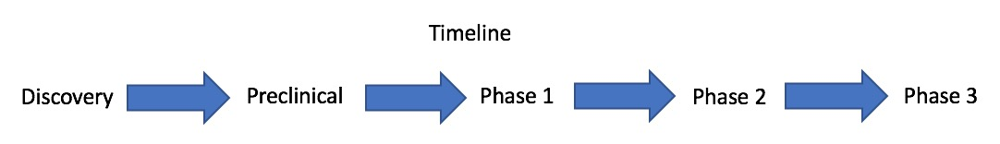

```{r setup, include=FALSE}
knitr::opts_chunk$set(echo = TRUE)
# can use it next time to add a pic by the title. don't need the R chunk.
#<script>
   #$(document).ready(function() {
     #$head = $('#header');
     #$head.prepend('')
   #});
#</script>
```

# Reference

